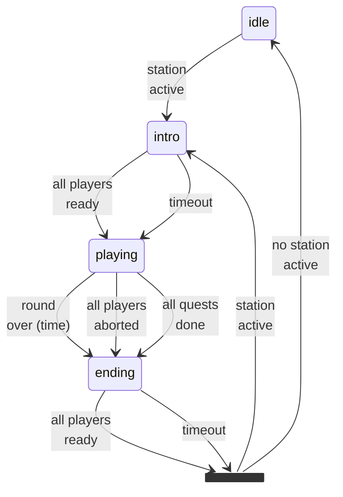
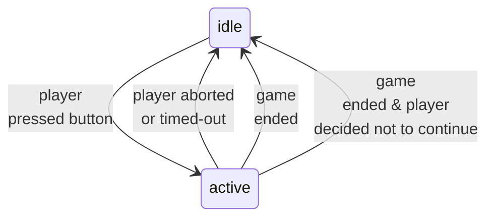
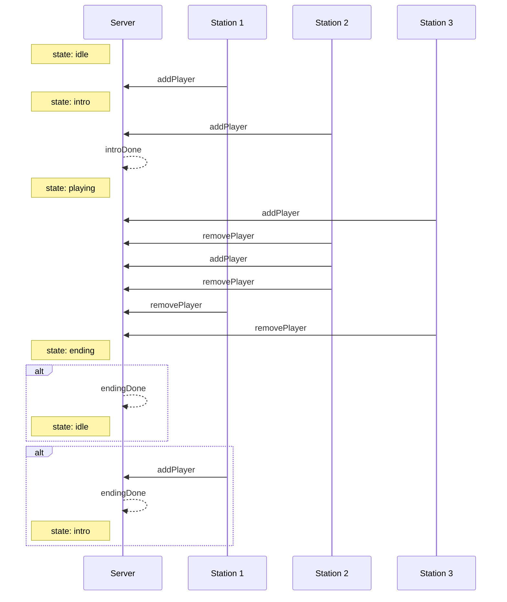

# Notes about the game stateHandler

The game can be in the following states:

- **idle**: No one is playing. This is a "demo" / "attract players" mode.
- **intro**: At least one station has a player, but the round has not started yet.
- **playing**: A round of the game is in progress.
- **ending**: The round is over, results are being shown.

Transitions between these states happen in this way:

- idle → intro: A player presses a button on a station.
- intro → playing: Either
  - If there's an intro sequence, it ended, timed out, or every player pressed a button to skip it.
  - If there's no intro, the server might jump straight to playing.
- playing → ending: The round is over, because: 
  - the timer ran out
  - all quests have been completed (all players ready to move on)
  - the last remaining player aborted the game
- ending → idle: The results have been shown. Every player is ready to move on, or the ending timed out. The game is now idle again.
- ending → intro: If a station became active during the ending sequence, a new round starts immediatelly.

Game stations can be in the following states:

- idle: No one is playing.
- active: A player is playing.

Transitions between these states happen in this way:

- idle → active: A player presses a button on the station.
- active → idle: When 
  - the game transitions from ending to idle
  - the game transitions from ending to intro but the player in this station decided not to continue

### Messaging and state

Players can be added to the server on any state. They can only be removed
from the server on the playing state. The server transitons to the
ending state when all players have been removed.

### Proposal: Sessions

This proposal should clarify state handling. A session is the span of a player's participation in a
game round.

Sessions are handled by the server. The server is responsible for starting and ending sessions.

- A session is created when requested by a station.
- A session ends when:
  - the station requests it
    - The player aborted the game
    - The station timed out (no input from the player)
  - the server decides:
    - the game round ended
    - the station that held the session requested a new one 

The main difference this would achieve from the current state is it would make the communication
between the client and server more stateful. Each session would have an id, so its state could be 
tracked, and messages like "playerReady" would be associated with a session. If a station doesn't
know about a session, or the server receives a message for a session that doesn't exist, they could
be ignored.
