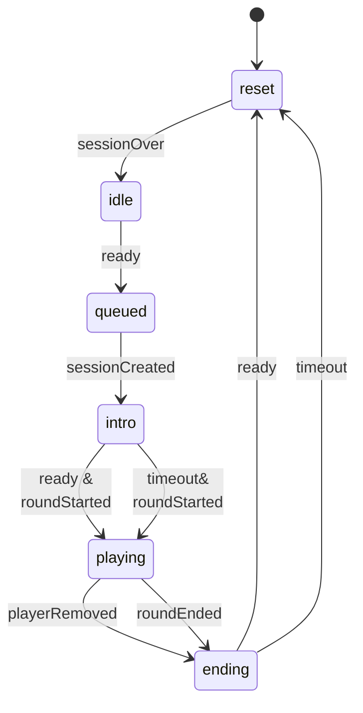
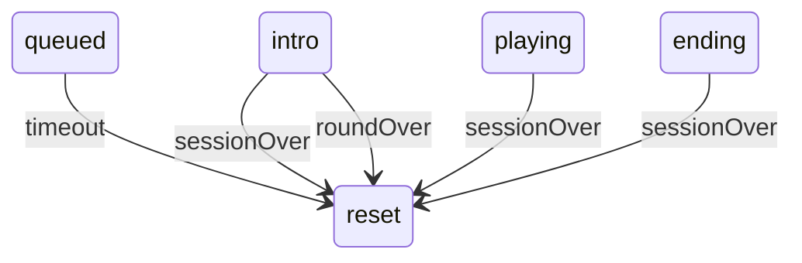
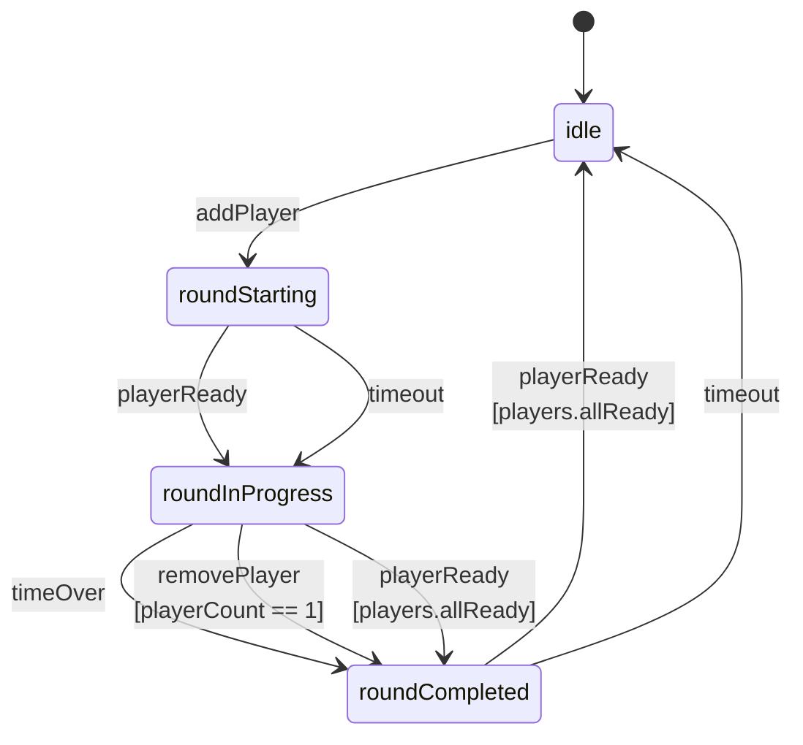

# State tracking

The server tracks the state of **rounds**. A round is an instance of a storyline that involves one 
or more players.

Client stations track the state of **session**. A session is a player's participation in the round.

The state of a round and a session are not the same. A session might start minutes after the round began 
(another player initiated it), and end while the round is still going on (other players are still 
playing). 

## Station (Session state)

Client stations track the session state through PlayerApp::setState and PlayerAppState subclasses.

This state would be tracked client-side.

- **idle**: The station is in the title screen, waiting for a player.
- **queued**: The station is waiting for a round to start, either because there is no current round,
  or because the round is in its **roundCompleted** state, and we're waiting for a new round. 
- **intro**: The station is in the intro phase.
- **playing**: The station is in the play phase.
- **ending**: The station is in the ending phase.

#### Invariants

- **idle**: There should be no session.
- **intro**: The session should exist. No Pc. The round can't be "ending".
- **playing**: The session should exist. Pc exists. The round should have started.
- **ending**: The session should exist. No Pc.

### Error handling

- During **intro**, and **playing**, the session should exist. If the server
    removed the player, the station should reset back to idle.
- The **queued** state should eventually time out, and the station reset back to idle. 

## Game Server (Round state)

The server tracks the state of the round via GameManager::setState, and GameManagerState subclasses.

- **idle**: No one is playing.
- **roundStarting**: A round is starting. There's at least one player.
- **roundInProgress**: A round is being played.
- **ended**: The round has ended.

## Interplay between Game Server and the Stations

- **Game 'idle'**: No players. Stations can only be in the **idle**, or **ready** states.
- **Game 'roundStarting'**: One or more players. Stations can be **idle**, **ready** (waiting to get 
   the server response), or **intro** (waiting for the player to press the button).
- **Game 'roundInProgress'**: At least one station is in the **intro**, or **playing** state. The rest could be in any state.
- **Game 'roundCompleted'**: At least one station is in the **ending** state. The rest could be in 
  **ending**, **ready**, or **idle**.

