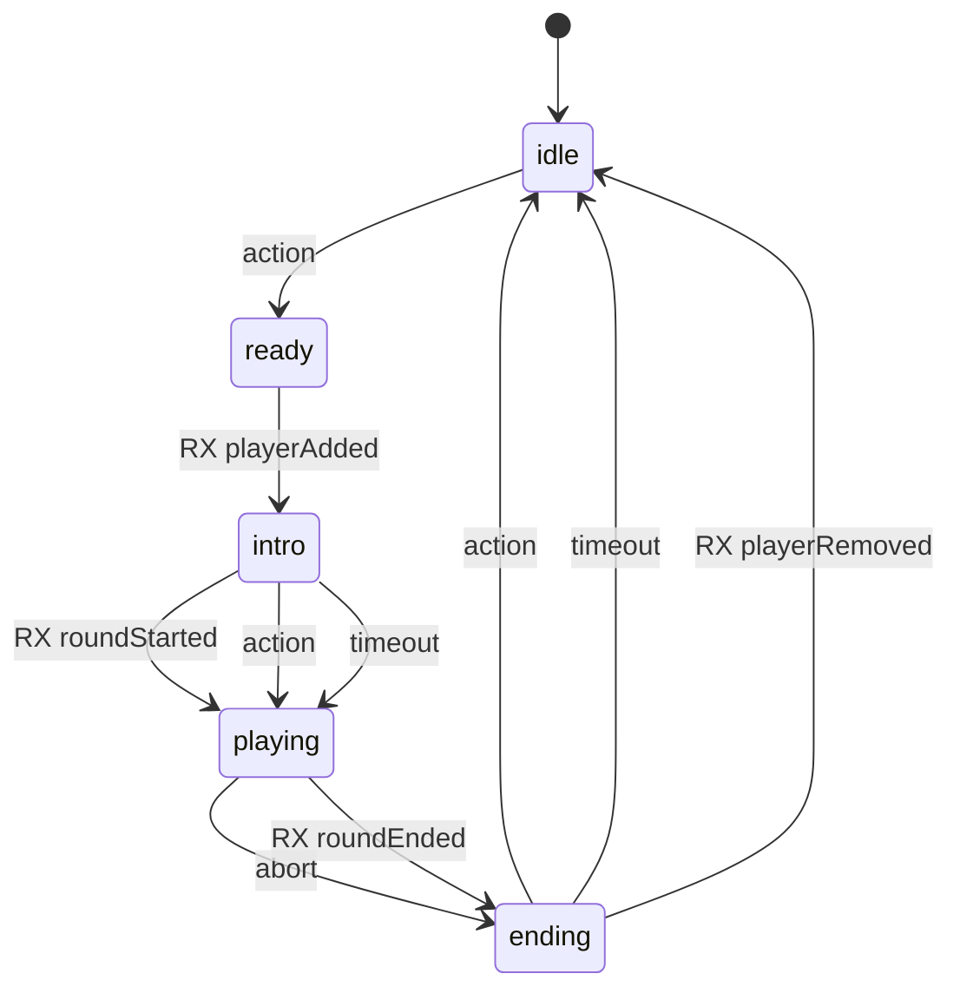
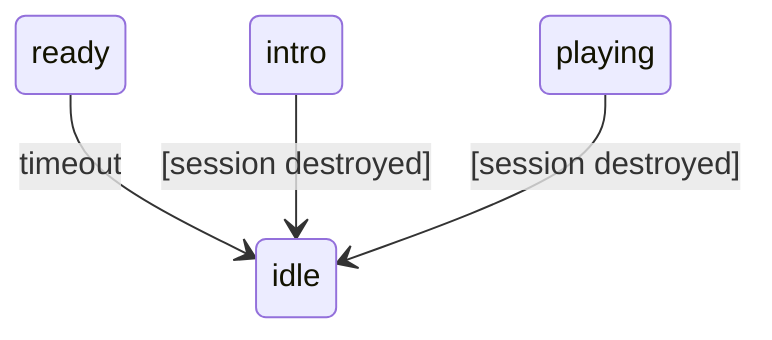
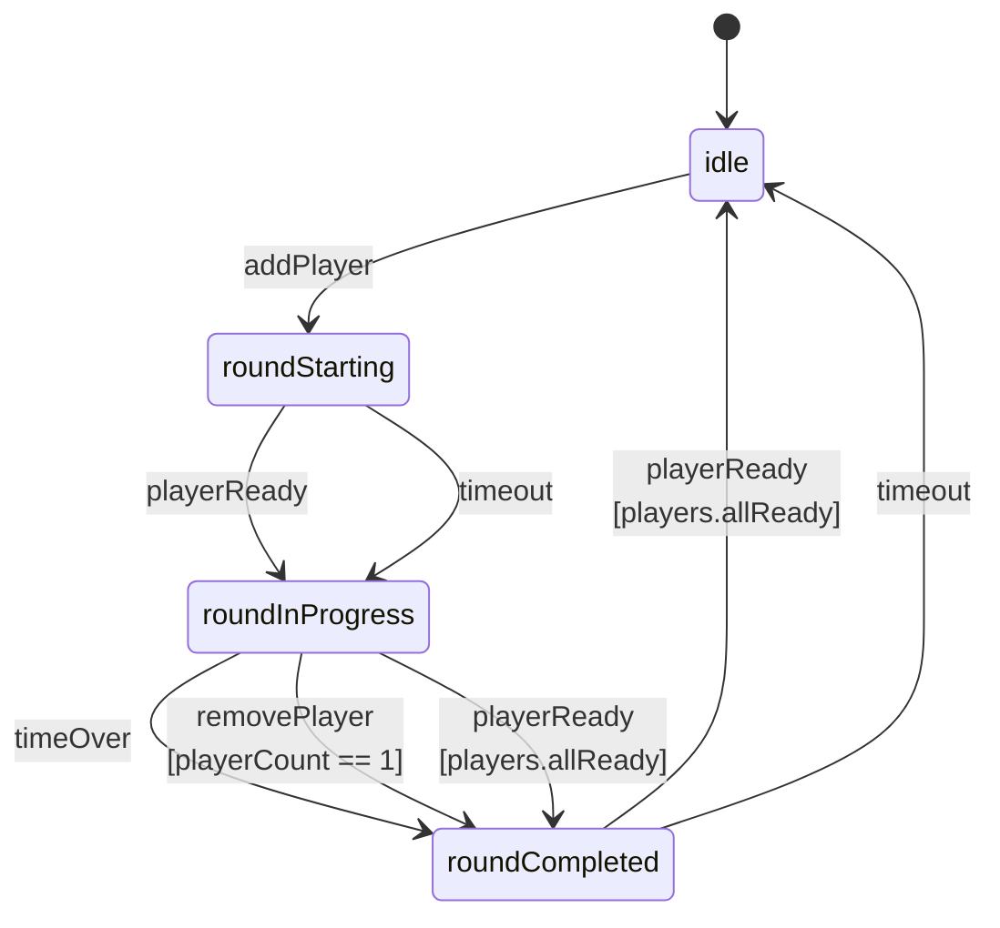

# A proposal to change the game's state tracking

## Station

This state would be tracked client-side.

- **idle**: The station is in the title screen, waiting for a player.
- **ready**: The station is waiting for a round to start, either because there is no current round,
  or because the game is in its **ended** state, and we're waiting for a new round. 
- **intro**: The station is in the intro phase of the game.
- **playing**: The station is in the play phase of the game.
- **ending**: The station is in the ending phase of the game.

### Error handling

- During **intro**, and **playing**, a session should exist. If the server
    destroyed the session, the station should reset back to idle.
- The **ready** state should eventually time out, and the station reset back to idle. 

## Game Server

- **idle**: No one is playing.
- **roundStarting**: A round is starting. There's at least one player.
- **roundInProgress**: A round is being played.
- **ended**: The round has ended.

## Interplay between Game Server and the Stations

- **Game 'idle'**: No sessions exist. Stations can only be in the **idle**, or **ready** states.
- **Game 'roundStarting'**: One or more sessions exist. Stations can be **idle**, **ready** (waiting to get 
   the server response), or **intro** (waiting for the player to press the button).
- **Game 'roundInProgress'**: At least one station is in the **intro**, or **playing** state. The rest could be in any state.
- **Game 'roundCompleted'**: At least one station is in the **ending** state. The rest could be in 
  **ending**, **ready**, or **idle**.

